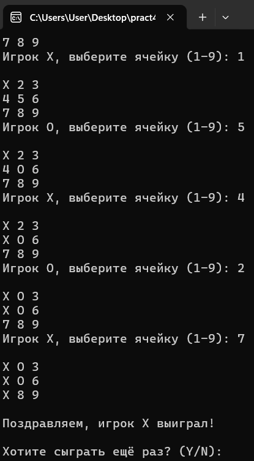
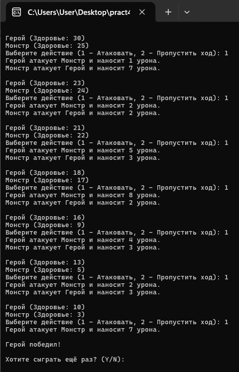

# Практическая работа №4. Консольные мини-игры (Часть 2)

## Описание проекта

Данный проект является практической работой по программированию на C++. Реализованы две консольные мини-игры, демонстрирующие работу с классами, структурами, обработкой ввода и генерацией случайных чисел.

## Мини-игра №3: "Крестики-нолики"

### Описание
Консольная игра, в которой два игрока по очереди делают ходы на поле 3x3. Цель — составить линию из трех одинаковых символов (крестики или нолики) по горизонтали, вертикали или диагонали.

### Функциональность
- Отображение игрового поля в консоли.
- Проверка корректности ввода (числа от 1 до 9, свободные ячейки).
- Обнаружение победителя или ничьей.
- Возможность начать новую игру после завершения.

### Скриншот

## Мини-игра №4: "Битва с монстром"

### Описание
Пошаговая консольная игра, в которой герой сражается с монстром. Каждый персонаж имеет характеристики здоровья, силы атаки и защиты.

### Функциональность
- Создание персонажей с случайными характеристиками.
- Выбор действий игрока (атака или пропуск хода).
- Автоматический ответ монстра.
- Проверка окончания игры (победа или поражение).
- Возможность начать новую битву.

### Скриншот

